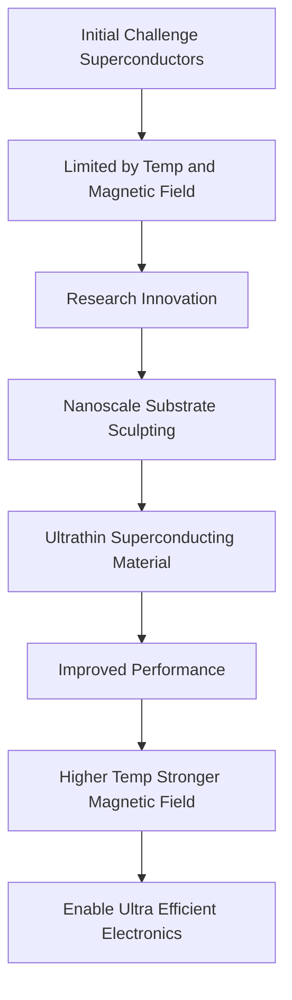

## Superconductivity Gets a Boost: A Breakthrough for Ultra-Efficient Electronics

**June 19, 2026** – Science is abuzz with a significant leap forward in superconductivity research. Swedish scientists at Chalmers University of Technology have unveiled a clever nanoscale redesign that could unlock a new era of ultra-efficient electronics. This breakthrough, reported on June 17, 2026, addresses one of the biggest challenges in superconductivity: maintaining its properties at higher temperatures and under stronger magnetic fields.

Superconductors, materials that can carry electrical current with no energy loss, hold immense promise for future technology, from advanced computers to more efficient energy grids. However, their practical application has been limited by the need for extremely low temperatures and weak magnetic fields.

The Swedish team's innovation lies in subtly sculpting the surface beneath an ultrathin superconducting material. By making nanoscale modifications to the supporting substrate, they discovered they could enable the superconducting material to operate at previously unattainable higher temperatures and resist much stronger magnetic fields. This novel approach tackles a major hurdle, potentially moving superconducting technologies closer to widespread practical use in electronics, energy systems, and quantum devices.

