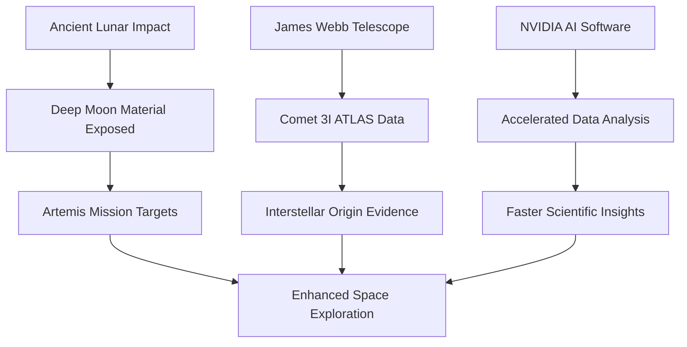

## Science Unveils Lunar Secrets, Cosmic Origins, and AI Acceleration (June 22, 2026)

As of June 22, 2026, the scientific community continues to push the boundaries of knowledge, revealing astounding insights into our solar system, distant cosmic travelers, and the very tools we use for discovery. This week brings exciting news from lunar exploration, interstellar phenomena, and the accelerating role of artificial intelligence in research.

A groundbreaking study by the Southwest Research Institute revealed that a colossal ancient impact on the Moon may have scattered pieces of its deep interior to locations surprisingly close to future Artemis landing sites. This discovery, published today, provides new, accessible targets for astronauts to investigate the Moon's earliest history and internal structure. By recreating the impact that formed the giant South Pole-Aitken basin, scientists found that a low-angle strike from a large, iron-cored object blasted mantle rocks across the lunar surface, potentially transforming upcoming missions.

Further afield, the James Webb Space Telescope (JWST) has offered an unprecedented look at Interstellar Comet 3I/ATLAS. Observations captured as the comet moved away from the Sun in December 2025 revealed a surprising chemical makeup, including exceptionally high levels of deuterium and only traces of carbon-13. This suggests the comet may have originated in a very cold system much earlier in our galaxy's history, raising questions about the commonality of conditions suitable for life in the universe.

Meanwhile, the realm of scientific discovery itself is being revolutionized by artificial intelligence. NVIDIA has introduced new AI software, including the DAQIRI library and ALCHEMI NIM microservices, designed to dramatically accelerate scientific research. These tools transform tasks that once took days on traditional CPUs into real-time, GPU-accelerated pipelines, speeding up data generation and insight across disciplines like materials science and experimental astronomy. This builds on advancements like NASA's Perseverance Rover successfully completing its first AI-planned drive on Mars, marking a significant milestone in autonomous navigation for extraterrestrial environments.

The continuous interplay between advanced observational tools and cutting-edge computational power is paving the way for a deeper understanding of our universe.

