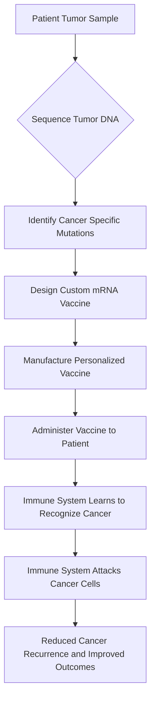

## Science in Action: Personalized mRNA Vaccines Show Promising Results Against Cancer

In a significant leap forward for cancer treatment, personalized mRNA cancer vaccines are demonstrating remarkable efficacy in clinical trials, offering renewed hope for patients battling the disease. As of June 2026, new data highlights the potential of these tailored therapies to significantly reduce the risk of cancer recurrence and mortality.

The core of this innovative approach lies in training a patient's own immune system to recognize and attack their specific cancer cells. The process begins with sequencing an individual's tumor to identify its unique mutations and proteins. Based on this genetic blueprint, a custom mRNA vaccine is then engineered. Once administered, this vaccine instructs the immune system to target these specific cancer markers, essentially turning the body's natural defenses into a precision weapon against the disease.

For instance, a recent melanoma trial in South Carolina reported a 40-50% reduction in the risk of recurrence or death for patients who received a personalized mRNA vaccine alongside immunotherapy, compared to those receiving immunotherapy alone. This breakthrough underscores the potential for highly individualized treatments to transform oncology, moving towards a future where cancer care is as unique as the patient themselves.

Here's how the personalized mRNA cancer vaccine process generally works:

