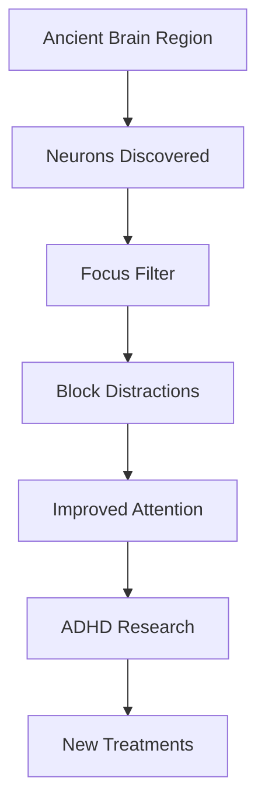

## Unlocking Focus: Scientists Discover Brain's "Distraction Switch"

In exciting news for neuroscience, researchers at Johns Hopkins University have identified a hidden "focus switch" in an ancient part of the brain that could revolutionize our understanding and treatment of attention disorders. This breakthrough, announced today, June 24, 2026, sheds new light on how our brains filter distractions and maintain concentration.

Scientists uncovered a small cluster of neurons located in an evolutionarily old brain region. These cells appear to function as a "built-in focus filter," enabling the brain to disregard irrelevant stimuli and hone in on what truly matters. When these specific neurons were temporarily deactivated in mice, the animals exhibited heightened distractibility, a behavior akin to symptoms seen in individuals with ADHD. Crucially, when the neurons were reactivated, the mice regained their normal ability to focus, even in the presence of strong distractions.

This discovery suggests a fundamental brain system for attention that is shared across all vertebrates, including humans. The findings offer promising new avenues for developing more precise treatments for attention-related disorders like ADHD.

This groundbreaking research provides a deeper insight into the neural mechanisms underlying attention and distraction, potentially paving the way for significant advancements in therapeutic strategies for millions worldwide.