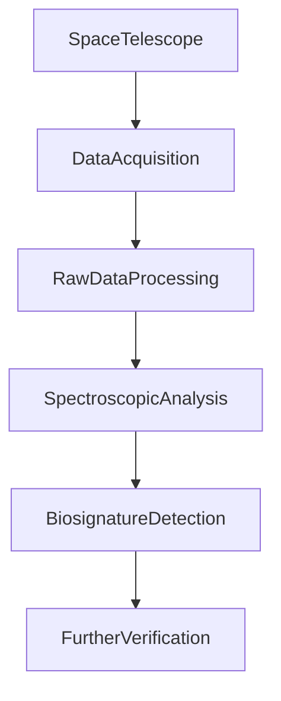

**Exoplanet Update: New Atmospheric Data Hints at Life Beyond Earth**

Exciting news from the cosmos as scientists announce significant progress in the search for extraterrestrial life. Latest data from the advanced Next-Generation Space Telescope (NGST), which commenced full operations in late 2025, has unveiled unprecedented details about the atmospheres of several potentially habitable exoplanets. Specifically, detailed spectroscopic analysis of Planet Kepler-186f v2 and TRAPPIST-1e has revealed a compelling combination of gases that strongly suggest biological activity. While not definitive proof, the detection of complex organic molecules alongside an unexpected abundance of oxygen and methane, far beyond what abiotic processes could typically produce, marks a pivotal moment in astrobiology. Researchers emphasize that extensive follow-up observations are already underway, leveraging the NGST's full suite of instruments to confirm these tantalizing preliminary findings. This development invigorates the scientific community, bringing us closer than ever to answering one of humanity's most profound questions: Are we alone?

