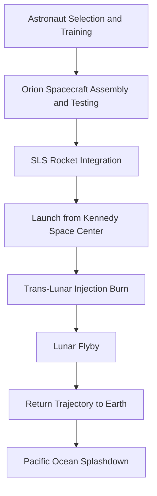

## Humanity Reaches for the Moon: Artemis II Mission Set for Historic Journey

**July 04, 2026** – Fifty-four years after the last human footsteps graced the lunar surface, humanity is once again poised for a monumental leap into deep space. The Artemis II mission, targeting a launch as early as February 2026, will send four astronauts on a historic flyby around the Moon, marking the first crewed mission to travel beyond low Earth orbit since Apollo 17 in 1972.

This ambitious endeavor serves as a crucial dress rehearsal for future lunar landings, demonstrating that humans can safely operate in cislunar space. The mission, planned to last approximately 10 days, will see the Orion spacecraft carry its crew on a trajectory around the Moon, testing critical systems and procedures essential for establishing a long-term human presence on and around our celestial neighbor.

The significance of Artemis II extends beyond its immediate objectives. It represents a global collaboration and a renewed commitment to space exploration, paving the way for future missions that aim to unlock the Moon's secrets and eventually, journey to Mars. This mission is a powerful step forward, transforming decades of planning into lived experience and inspiring a new generation to look up and dream.

