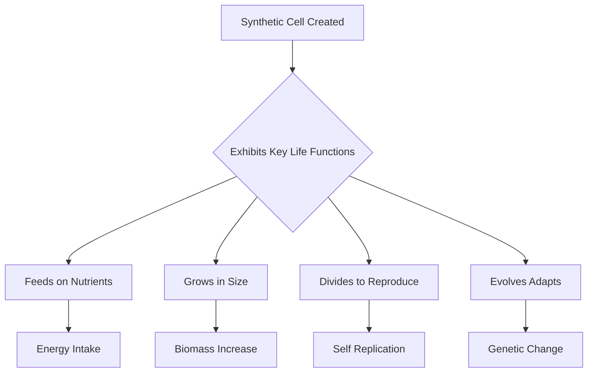

## Breakthrough in Synthetic Biology: Biologists Create Self-Sustaining Artificial Cell

**July 5, 2026** – The world of science is abuzz with a monumental achievement in synthetic biology: researchers have successfully created a synthetic cell capable of feeding, growing, dividing, and even evolving. This groundbreaking development, reported on July 4, 2026, marks a significant leap forward in our understanding of life's fundamental processes and opens new avenues for biotechnology.

For the first time, biologists have engineered a cell from the ground up that exhibits the core characteristics of living organisms. This artificial entity can take in nutrients ("feed"), increase in size ("grow"), replicate itself into daughter cells ("divide"), and adapt to its environment over generations ("evolve"). The ability to create such a complex, self-sustaining system from non-living components holds profound implications, potentially revolutionizing fields from medicine and materials science to energy production. It offers an unprecedented tool for studying life at its most basic level, free from the inherent complexities of natural cells.

This incredible feat comes alongside other remarkable discoveries this week, underscoring the rapid pace of scientific advancement. Just days ago, astronomers announced the discovery of a potentially habitable "super-Earth" exoplanet located a mere 25 light-years away. Such findings continually push the boundaries of our knowledge, from the smallest units of life to distant cosmic worlds.

The creation of this synthetic cell represents a new frontier in biology, promising to unlock secrets of life and enable innovations previously confined to science fiction. As researchers continue to explore and harness its capabilities, the coming years are sure to bring even more transformative discoveries.