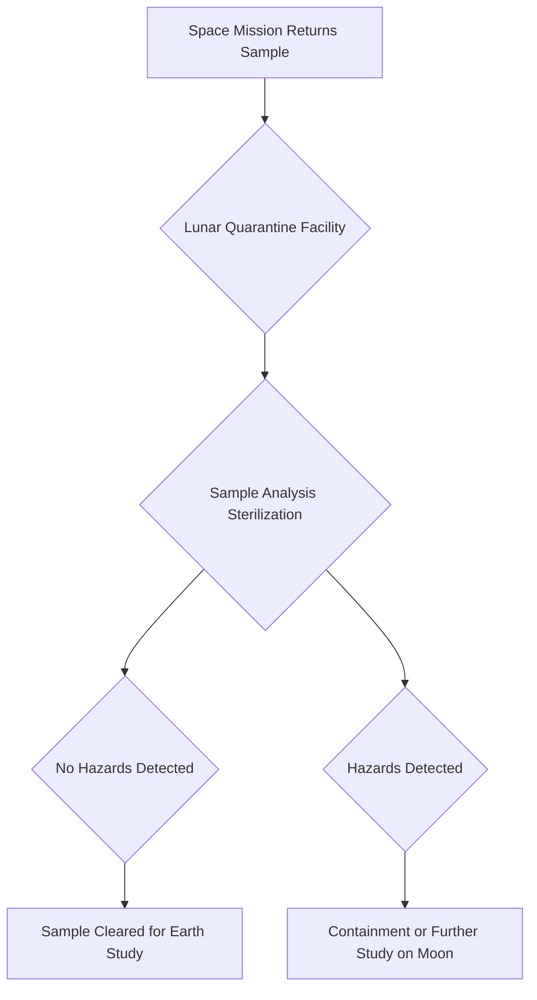

## The Moon: Our First Line of Defense Against Alien Invaders?

**July 06, 2026** – As humanity ventures further into the cosmos, the prospect of encountering extraterrestrial life, even microscopic, becomes increasingly real. Today, scientists are championing a visionary solution to safeguard Earth from potential biological contamination: a dedicated lunar quarantine facility.

Researchers are advocating for a specialized biocontainment facility on the Moon, designed to meticulously examine samples returned from Mars, asteroids, and other celestial bodies before they ever reach Earth's delicate ecosystems. The concern isn't just about fantastical alien monsters, but the unpredictable effects even a tiny, unknown microorganism could have on our planet. Experts point to Earth's own history of invasive species, demonstrating how small biological introductions can lead to significant ecological disruptions.

By establishing this "biological firewall" on the Moon, scientists hope to leverage robotic handling systems to eliminate the risk of accidental exposure or release on Earth. This proactive approach underscores a critical evolution in planetary protection strategies, acknowledging that as space exploration accelerates, so too must our measures to protect our home world. The proposal comes as NASA and other space agencies prepare for more ambitious sample-return missions in the coming years.

