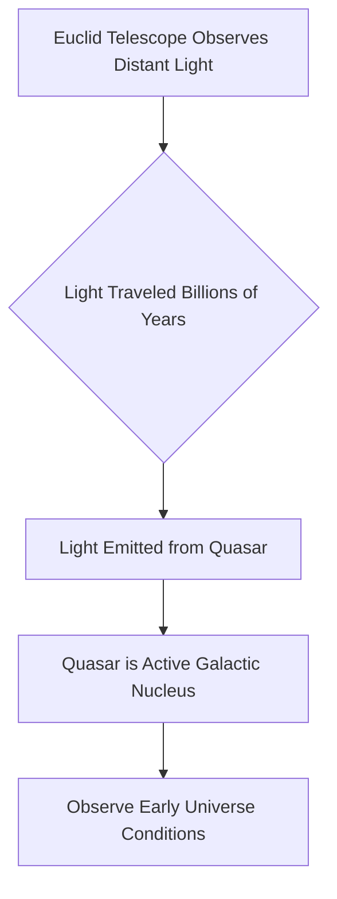

## Glimpse into the Cosmic Dawn: Euclid Telescope Uncovers Ancient Quasars

**July 11, 2026** – Today marks a significant step forward in our quest to understand the universe's earliest moments, as Europe's Euclid telescope has delivered an astonishing haul: the discovery of 31 of the oldest known quasars. This finding effectively doubles the number of such objects identified from the universe's initial stretches.

Quasars are incredibly luminous active galactic nuclei, powered by supermassive black holes accreting matter at immense rates. Their intense brightness allows astronomers to observe them across vast cosmic distances, essentially looking back in time to when the light was first emitted.

Among the newly discovered quasars, two stand out with redshifts of 7.77 and 7.69, making them the earliest quasars observed to date. To put this in perspective, these objects were already fully formed when the cosmos was less than a billion years old—a remarkably tight timeframe for black holes to accumulate masses roughly a billion times that of our Sun. The light from these ancient behemoths began its journey over 13 billion years ago, finally reaching Euclid's detectors today.

This unprecedented discovery by the Euclid telescope provides a powerful "time machine" for scientists. By studying these ancient quasars, researchers gain invaluable insights into the formation and evolution of galaxies and their central supermassive black holes in the very early universe. The data challenges existing models of cosmic evolution, suggesting that massive structures formed much faster than previously theorized.

The continued exploration by instruments like Euclid promises to unlock further secrets from the universe's infancy, piecing together the grand cosmic narrative.

