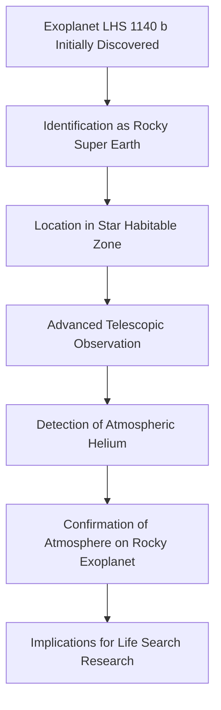

## Cosmic Breath: Astronomers Confirm Atmosphere on Rocky Exoplanet in Habitable Zone

**July 17, 2026** – Humanity's quest for life beyond Earth just took a monumental leap forward. Yesterday, astronomers reported the first observationally confirmed atmosphere around a rocky exoplanet located within its star's habitable zone. This groundbreaking discovery centers on LHS 1140 b, a "super-Earth" approximately 49 light-years from our solar system.

The pivotal finding, announced on July 16, 2026, details the detection of helium escaping from the upper atmosphere of LHS 1140 b. This observation marks a critical milestone, moving beyond theoretical models to direct evidence of atmospheric presence on a potentially habitable world. Such a discovery provides invaluable data for understanding planetary formation and the conditions necessary for life to emerge.

The presence of an atmosphere is a key indicator of a planet's potential to host liquid water and regulate surface temperatures, crucial elements for habitability. While the detection of helium doesn't directly confirm a life-sustaining atmosphere, it opens a new avenue for follow-up studies to characterize its composition and density. This monumental step brings scientists closer to identifying Earth-like worlds and understanding our place in the cosmos.

### The Journey to an Atmospheric Discovery

