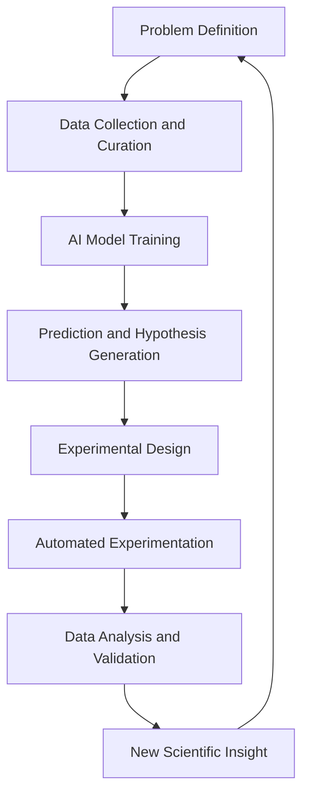

## AI Propels Science Forward: Unlocking New Eras of Discovery

Today, July 19, 2026, the scientific community is abuzz with the continued, breathtaking acceleration of discovery, largely spearheaded by advanced artificial intelligence. From designing revolutionary new medicines to engineering next-generation materials, AI is no longer just a tool but a fundamental partner in pushing the boundaries of what's possible. The latest reports highlight how AI is streamlining research pipelines, making breakthroughs faster and more efficient than ever before.

In the realm of medicine, AI-driven platforms are transforming drug discovery and personalized treatments. Researchers are leveraging AI to sift through vast biological datasets, predict molecular interactions with unprecedented accuracy, and rapidly identify promising drug candidates. This has significantly shortened the lead time for new therapies, offering renewed hope for intractable diseases and enabling truly individualized treatment plans based on a patient's unique genetic profile and health data. Clinical trials are becoming smarter, with AI optimizing participant selection and monitoring for more effective and quicker results.

Beyond biology, AI is revolutionizing materials science. The discovery of novel materials with specific properties—whether for high-density energy storage, sustainable construction, or advanced computing—traditionally relied on laborious trial-and-error experimentation. Today, AI algorithms can simulate material behaviors at atomic levels, predict optimal compositions, and even suggest entirely new molecular structures. This capability is accelerating the development of superconductors, highly efficient catalysts, and lighter, stronger alloys crucial for a sustainable future and technological advancement.

The profound integration of AI into scientific methodology marks a new era. It empowers scientists to tackle complexities previously unimaginable, fostering a symbiotic relationship where human ingenuity guides AI, and AI in turn augments human insight, leading to a cascade of groundbreaking discoveries that are reshaping our world in real-time.

