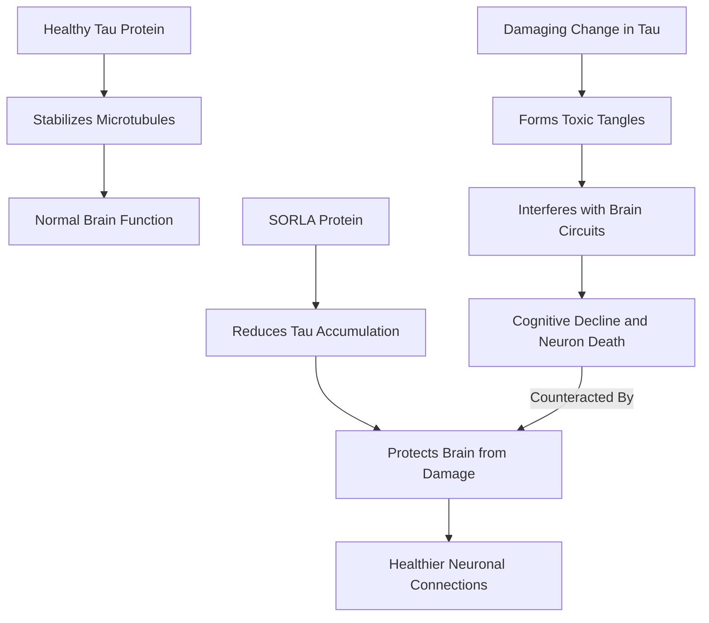

## Hope for Alzheimer's: Scientists Discover Brain-Protecting Protein

**July 20, 2026** – In a significant leap forward for neurodegenerative disease research, scientists at Sanford Burnham Prebys have reported the discovery of a protein that may actively protect the brain from the damaging effects of Alzheimer's disease. Published on July 17, 2026, in Science Advances, this finding offers new hope and a potential target for future therapies.

Alzheimer's disease and related conditions are characterized by the abnormal aggregation of tau protein, which normally plays a crucial role in stabilizing the internal structure of nerve cells. When tau undergoes a damaging change, it twists into toxic tangles that disrupt brain circuits, leading to cognitive decline and the death of neurons.

The newly identified protein, called SORLA, appears to act as a powerful natural defense against these harmful tau tangles. Researchers found that mice with increased levels of SORLA exhibited less tau accumulation, reduced brain atrophy, and maintained healthier connections between neurons. Conversely, mice lacking SORLA experienced more severe damage. This research suggests that strengthening this natural defense mechanism could potentially mitigate the devastating effects of tau-related diseases.

This discovery not only sheds light on the complex mechanisms underlying Alzheimer's but also opens avenues for developing new drugs that could harness or enhance SORLA's protective capabilities, marking a crucial step in the ongoing fight against this debilitating disease.

