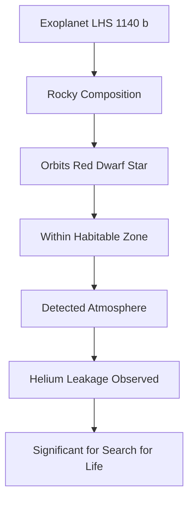

## Exoplanet LHS 1140 b: First Rocky World in Habitable Zone with Confirmed Atmosphere!

July 25, 2026 – In a groundbreaking announcement that marks a significant leap in the quest for life beyond Earth, astronomers have confirmed the presence of an atmosphere around a rocky exoplanet located within its star's habitable zone. The planet, designated LHS 1140 b, offers an unprecedented target in the search for extraterrestrial life.

Orbiting a cool red dwarf star approximately 48 light-years away, LHS 1140 b has long been identified as a promising candidate due to its rocky composition and position within the habitable zone – the region around a star where conditions could allow for liquid water to exist on a planet's surface. What makes this new finding so extraordinary is the direct detection of its atmosphere.

Scientists observed helium slowly leaking into space from LHS 1140 b, providing the strongest evidence to date that a rocky planet with Earth-like temperatures outside our solar system has retained an atmosphere for billions of years. This discovery is crucial because an atmosphere is considered essential for a planet to support life as we know it, regulating temperature and protecting the surface from harsh stellar radiation.

This milestone represents a turning point, validating earlier theoretical predictions and providing a new framework for identifying other potentially habitable worlds. Researchers are now eager to further investigate LHS 1140 b, hoping to determine the complete chemical makeup of its atmosphere and search for other features associated with habitability, such as surface oceans.

The detection of this atmosphere pushes the boundaries of exoplanetary science, bringing us closer to understanding how common potentially life-supporting worlds might be in our galaxy.

