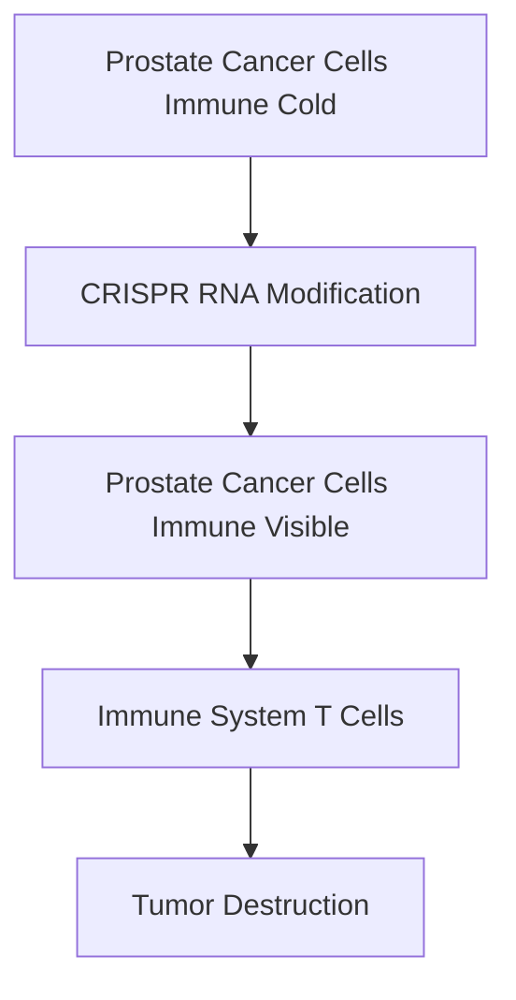

**CRISPR Breakthrough Boosts Prostate Cancer Immunotherapy**

In a significant advance for cancer treatment, scientists have utilized CRISPR technology to make prostate cancer cells vulnerable to immunotherapy, a treatment often ineffective against this particular cancer. Published on July 26, 2026, this experimental approach dramatically improved immunotherapy's effects in mice and offers new hope for hard-to-treat tumors.

Prostate tumors are frequently described as "immune cold," meaning they attract very few T cells, the immune cells responsible for identifying and destroying cancer. This lack of T-cell infiltration has been a major hurdle for effective immunotherapy.

Researchers developed a CRISPR-based tool to modify RNA within prostate cancer cells. This modification effectively transforms the "immune cold" tumors into targets that the immune system can readily detect and attack. The study demonstrated that this technology enhanced the response of prostate tumors to immune checkpoint therapy in mice, leading to more immune cells entering the tumors and successfully destroying cancer cells.

This novel approach holds immense promise, not only for prostate cancer but potentially for other cancers that evade immune detection. By turning "hidden" tumors into visible targets, this CRISPR innovation could pave the way for more personalized and effective cancer therapies, reducing the need for harsh conventional treatments.

