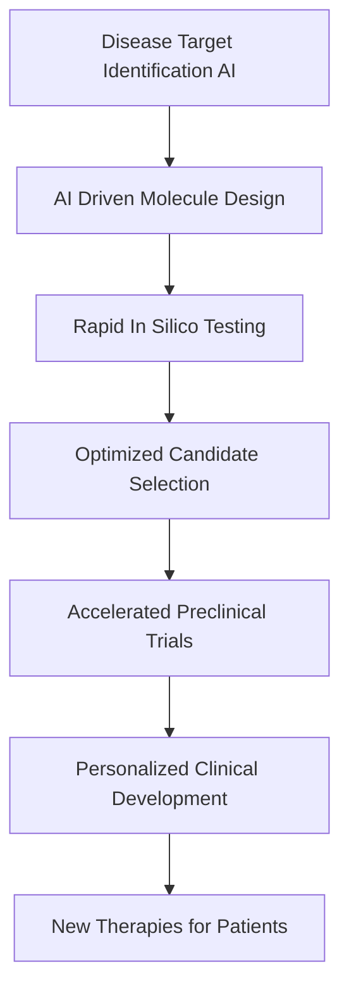

## AI Propels Drug Discovery and Personalized Medicine into a New Era

**July 27, 2026** – The world of science is buzzing with breakthroughs as artificial intelligence (AI) continues to redefine the landscape of drug discovery and personalized medicine. As of mid-2026, AI is not just assisting but actively driving the development of new therapies, dramatically compressing timelines and ushering in an age of highly tailored treatments for patients worldwide.

Leading the charge, AI-driven drug discovery platforms are now routinely identifying viable drug candidates in months rather than years, a stark contrast to the traditional decade-long process. Companies such as Insilico Medicine and Recursion Pharmaceuticals are making headlines, with AI-discovered drugs already progressing through clinical trials for various conditions, including idiopathic pulmonary fibrosis and certain lymphomas. This acceleration is fundamentally reshaping the pharmaceutical industry, allowing for faster translation of scientific insights into potential cures. The global AI in drug discovery market is projected to reach approximately $5 billion this year, reflecting significant investment and rapid adoption.

Beyond speed, AI is also revolutionizing personalized medicine. By integrating vast datasets—including genomics, electronic health records, lifestyle factors, and real-time monitoring from wearable devices—AI is enabling clinicians to craft tailored diagnostic and treatment plans with unprecedented precision. This personalized approach is crucial for optimizing treatment efficacy and minimizing adverse effects, moving away from a one-size-fits-all model towards truly individualized care. Innovations in computational biology and AI-driven protein engineering are becoming foundational, allowing scientists to analyze complex biological datasets and engineer proteins with greater accuracy. A significant development this month saw Northwestern University receive a substantial $20 million grant to establish the AI-Driven, Rapid, Experimental Automation Machine (DREAM) Cloud Lab, a national resource dedicated to accelerating protein engineering through AI.

The impact of AI is profound, transforming every stage from initial target identification to patient-specific clinical development. While challenges in clinical validation and data integration persist, the momentum is undeniable, with AI firmly moving from an experimental tool to an indispensable platform in scientific research and development.

Here’s a simplified look at the AI-accelerated drug discovery pipeline:

As we move further into 2026, the convergence of AI with biotechnology promises to unlock even more profound discoveries, bringing us closer to a future where more effective and personalized medical solutions are within reach for everyone.