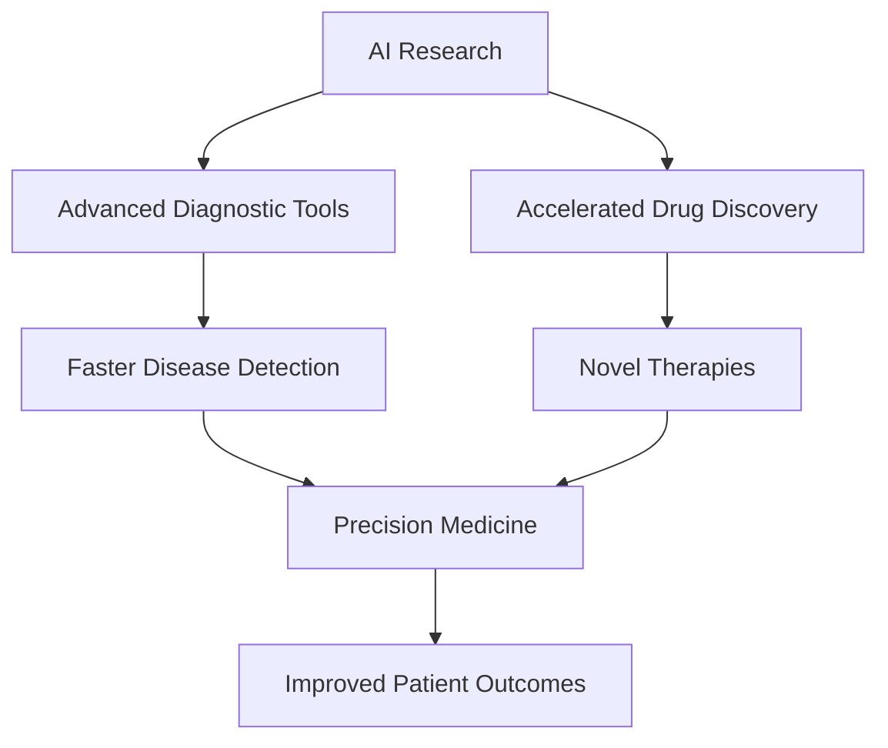

## Science Pulse: Mid-2026 Update – AI Revolutionizes Healthcare

**July 28, 2026** – As we hit the midpoint of 2026, the scientific landscape continues to evolve at an astonishing pace, with Artificial Intelligence (AI) standing out as a transformative force, particularly within healthcare. This year has cemented AI's role not just as a computational aid but as a core engine driving breakthroughs in diagnostics, drug discovery, and personalized treatment.

Recent developments highlight AI's unprecedented ability to process vast amounts of data and identify patterns far beyond human capacity. In medical diagnostics, AI systems are now routinely outperforming human experts in specific tasks. For instance, an AI called EchoNext demonstrated superior accuracy in detecting heart disease from electrocardiograms (ECGs) compared to cardiologists in a 2025 study. Similarly, initiatives like UF Health's GatorTron are assisting doctors in interpreting complex clinical data for faster decision-making. Further, Örebro University developed AI systems that analyze EEG data, achieving over 97% accuracy in distinguishing between healthy individuals and those with dementia, including Alzheimer's disease.

The realm of drug discovery is also experiencing a profound shift. Generative AI models are accelerating the design of new therapeutic compounds, from novel antibiotics that cured drug-resistant infections in mice (as demonstrated by MIT researchers) to molecules that enhance chemotherapy effectiveness in pancreatic cancer by targeting resistance mechanisms in tumor cells. This speed and precision promise to bring life-saving treatments to patients much faster than traditional methods.

The synergy between AI and other advanced technologies, such as quantum computing, is further accelerating innovation across various sectors, including healthcare. This rapid integration of AI is not just a trend for 2026; it's a fundamental restructuring of how medical research and practice are conducted, paving the way for a future of more accessible, accurate, and personalized healthcare.

