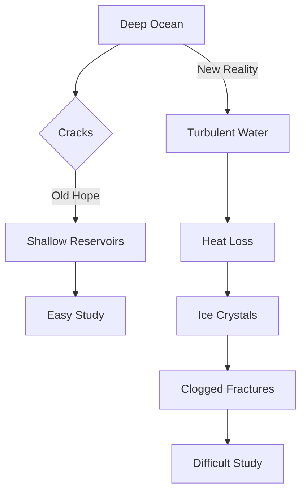

## Europa's Icy Enigma: The Search for Life Just Got Harder

Jupiter's moon Europa has long captivated scientists as one of the most promising locations in our solar system to search for extraterrestrial life, primarily due to the vast ocean of liquid water believed to be hidden beneath its thick, icy shell. However, recent simulations released on July 29, 2026, suggest that reaching this enigmatic ocean may be far more challenging than previously thought.

For decades, researchers held onto the hope that water from Europa's deep ocean might rise through cracks in the ice and form more accessible shallow reservoirs, making it easier for future spacecraft missions to study its composition and potential for life. This optimistic scenario envisioned a relatively straightforward pathway from the subsurface ocean to the surface.

However, new research led by Rutgers scientists indicates that this journey is unlikely. The simulations suggest that any turbulent water attempting to ascend through fractures would rapidly lose heat, causing ice crystals to form and quickly clog these pathways, sometimes within hours. This means the icy shell acts as a much stronger barrier than anticipated, trapping Europa's mysterious ocean deep beneath the surface and complicating efforts to directly sample its contents.

This finding reshapes our understanding of Europa's habitability and the strategies for future missions, highlighting the immense difficulties in directly accessing potential biosignatures from its hidden sea. While the prospect remains exciting, the engineering challenges have undoubtedly grown.

