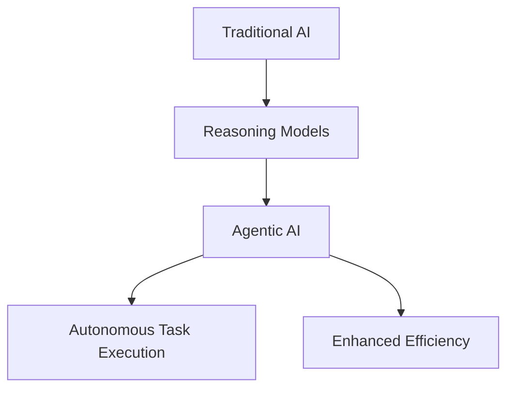

## AI's July Surge: Autonomous Agents and Smarter Reasoning Drive New Era

July 2026 has marked a pivotal month in artificial intelligence, showcasing rapid advancements that are reshaping how AI interacts with the world and tackles complex challenges. The most dominant trend has been the rise of "agentic AI," alongside significant breakthroughs in reasoning-capable models.

Agentic AI systems are intelligent agents operating with greater autonomy to execute intricate tasks, with organizations rapidly integrating them to boost efficiency, accuracy, and decision-making. A remarkable 100% of surveyed organizations plan to expand their use of agentic AI this year, with roughly 31% of workflows already automated by this technology. These advancements signal AI's growing capacity to engage with environments more sophisticatedly, both digitally and physically.

Concurrently, AI research has seen sustained improvements in reasoning models—those that "think" by generating chains of reasoning before producing a final answer. Recent research from MIT and Stanford highlighted that the effectiveness of these models relies more on how they are trained for self-correction during the reasoning process rather than solely on their size. This finding could lead to more sustainable AI development, prioritizing quality over quantity in model training. DeepMind's new "prospective credit assignment" training approach further enables AI models to handle complex, multi-step tasks, which is crucial for developing reliable AI agents capable of sustained reasoning.

This dynamic month also saw an "AI Price War" among leading model providers and increased regulatory activity, reflecting the industry's rapid evolution and growing societal impact.

