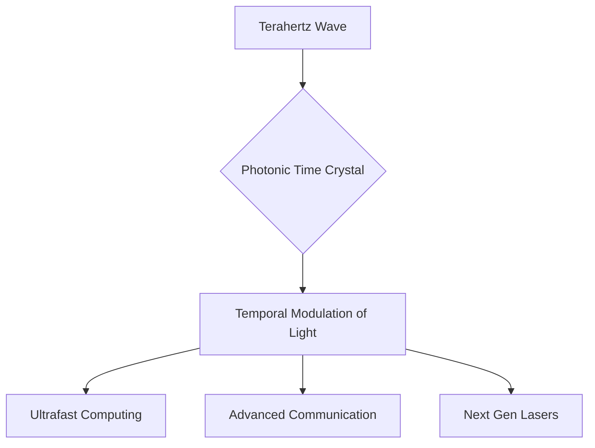

## World-First Photonic Time Crystal Unlocks New Era of Light Control

**July 31, 2026** – In a groundbreaking development that promises to reshape the future of technology, an international research team has successfully built the first-ever all-optical photonic time crystal. This achievement, reported today, marks a significant leap in our ability to control light, opening doors to previously unimaginable advancements in computing, communication, and imaging.

Scientists from École Polytechnique, Collège de France, and Helmholtz-Zentrum Dresden-Rossendorf (HZDR) have engineered a material designed to rapidly and repeatedly alter its optical properties over time. This innovative "time crystal" harnesses terahertz electromagnetic waves to induce strong, fast temporal modulations, allowing for unprecedented control over light's behavior at extraordinary speeds.

The implications of this breakthrough are vast. Controlling light within materials has already given rise to technologies like fiber optics and lasers, which are fundamental to modern life. The new photonic time crystal is expected to pave the way for ultrafast optical computers, dramatically smarter communication systems, advanced imaging techniques, and an entirely new generation of highly tunable lasers. This pioneering work pushes the boundaries of light-matter interaction and could define the next generation of photonic devices.

