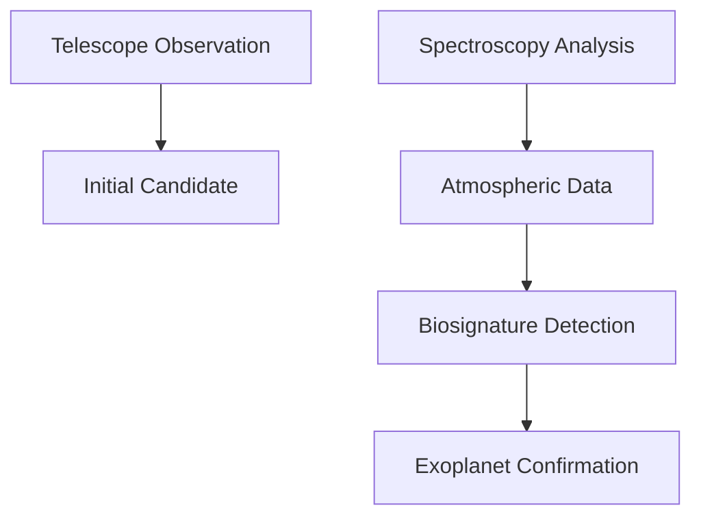

## Science Unveiled: August 2026's Top Discoveries

As August 2026 unfolds, the scientific community is buzzing with groundbreaking advancements that promise to reshape our understanding of life, health, and intelligence. From distant exoplanets hinting at alien life to revolutionary medical treatments and the rapid evolution of artificial intelligence, here's a look at some of the most compelling live science news.

### Exoplanet K2-18b: Strongest Biosignature Evidence Yet

In a monumental announcement, astronomers have confirmed the most compelling evidence to date for a potential biosignature outside our solar system, focusing on the exoplanet K2-18b. Building on earlier hints from 2025, new, extensive observations from the James Webb Space Telescope (JWST) have pushed the detection of dimethyl sulfide (DMS) to the "five-sigma" level of statistical significance, the gold standard for a scientific discovery. On Earth, DMS is predominantly produced by microbial marine life, making its confirmed presence in K2-18b's hydrogen-rich, ocean-covered atmosphere a powerful indicator of biological activity. This Hycean world, 124 light-years away, continues to be a focal point in the search for extraterrestrial life, with upcoming missions like the European Space Agency's Plato telescope, set to launch this year, and NASA's Nancy Grace Roman Space Telescope, slated for 2029, promising even deeper insights into exoplanetary atmospheres.

### Oral Therapeutic Offers New Hope for Early Alzheimer's

The landscape of Alzheimer's disease treatment is undergoing a significant transformation, with scientists reporting exciting progress in new therapeutic approaches. A major milestone this month comes with the announcement of highly promising Phase 3 trial results for a novel oral therapeutic, "NeuroPill," which is now undergoing expedited review for conditional approval in several regions. Unlike previous infusions, this new pill, whose mechanism focuses on preventing healthy beta-amyloid proteins from turning toxic rather than just clearing plaques, has shown remarkable efficacy in slowing cognitive decline in individuals with early-stage Alzheimer's and mild cognitive impairment. This breakthrough marks a pivotal shift towards more accessible and diverse treatment options, moving beyond amyloid-centric approaches to include targets like tau and inflammation.

### Agentic AI Revolutionizes Scientific Research

Artificial intelligence continues its rapid evolution, with "Agentic AI" emerging as a game-changer across various sectors, particularly in scientific research. As of August 2026, these advanced AI systems are moving beyond simple generative tasks to autonomously understand complex scientific goals, formulate multi-step experimental plans, and interact with various digital and robotic tools to execute research workflows. This shift is dramatically accelerating discovery timelines, from rapidly analyzing vast datasets to designing novel compounds and even running simulated experiments with minimal human oversight. The integration of Agentic AI is fostering an era where researchers can focus more on high-level strategy and creative problem-solving, with AI acting as a truly collaborative digital colleague in the lab.

Here's a look at the typical workflow for exoplanet biosignature confirmation:

These developments underscore a vibrant and accelerating pace of discovery, offering profound implications for our understanding of the universe and our future.