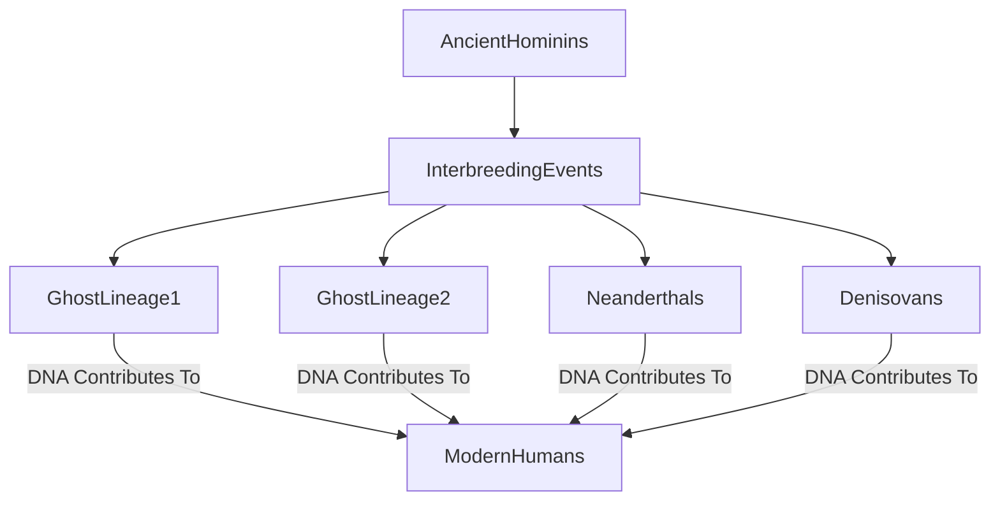

## Unveiling Our Hidden Ancestors: New DNA Traces Rewrite Human History

**August 2, 2026** – Just when we thought we knew our family tree, scientists have unveiled a fascinating twist: modern humans carry genetic traces from *two* previously unknown archaic human lineages, in addition to the familiar Neanderthals and Denisovans. This groundbreaking discovery, announced today, significantly deepens our understanding of the complex tapestry of human evolution.

For years, genetic studies have shown that *Homo sapiens* interbred with Neanderthals and Denisovans as they migrated out of Africa. Now, researchers at UC Berkeley have employed a novel method to meticulously examine hundreds of present-day human genomes. This intricate analysis allowed them to reconstruct ancient genealogical connections, revealing specific regions of our modern DNA that originated from these mysterious, unidentified ancestors.

One of these newly identified "ghost ancestors" appears to have interbred with modern humans in Africa over 50,000 years ago, predating the major exodus of *Homo sapiens* to Europe and Asia. DNA inherited from this lineage accounts for approximately 1% of the modern human genome, a proportion comparable to that from Neanderthals. The findings reinforce the evolving view of human origins as a rich history of encounters and genetic exchanges among numerous related hominin populations.

This revelation suggests that our evolutionary journey was far more intertwined and complex than previously imagined, with a multitude of archaic groups contributing to the genetic makeup of humanity today. It's a vivid reminder that the story of human ancestry continues to unfold, piece by fascinating piece.

