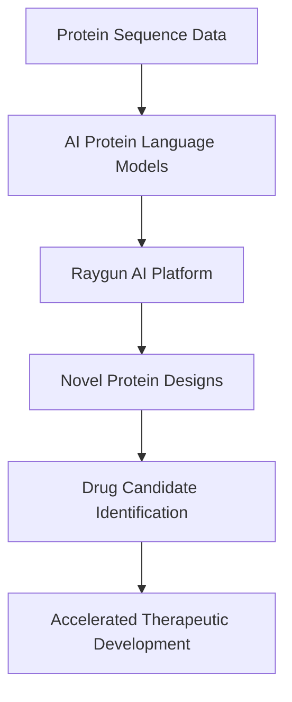

Here's a concise blog post on the latest in science news as of August 7, 2026.

***

### AI's August 2026 Breakthroughs Reshape Drug Discovery and Protein Engineering

The world of scientific discovery is abuzz this August 2026, with artificial intelligence continuing its relentless march into the very foundations of biological engineering and drug development. Recent advancements are not just incremental; they represent a significant leap towards designing biology with unprecedented speed and precision.

One of the most notable headlines comes from Duke University School of Medicine, where researchers have unveiled "Raygun," an artificial intelligence framework capable of redesigning proteins on a scale previously only observed in natural evolution. Published in Nature, this groundbreaking tool can generate shorter, longer, and highly modified versions of proteins while maintaining their critical structure and function. Raygun utilizes protein language models to make extensive modifications to existing proteins, rather than starting from scratch, allowing researchers to explore thousands of novel protein designs in fractions of a second. This innovation promises to unlock new avenues for engineering proteins with customized properties, paving the way for targeted medicines and advanced biological research.

Further underscoring AI's transformative impact, Insilico Medicine is making waves with its generative AI platform, which has successfully designed a drug candidate that has reached Phase 2 clinical trials for pulmonary fibrosis in under 18 months. This achievement marks a significant acceleration compared to traditional timelines, demonstrating AI's capacity to dramatically speed up drug development from end-to-end. Similarly, Mayo Clinic researchers have leveraged AI to develop an experimental drug that targets the "undruggable" PDZ-domain of the GIPC1 protein, which promotes the growth and treatment resistance of various cancers, including pancreatic cancer. In laboratory studies, this AI-assisted drug effectively slowed tumor growth and improved survival.

These breakthroughs highlight a new era where AI is not merely assisting but actively leading the charge in designing and discovering new biological entities and therapeutic compounds, promising a future of faster, more effective medical solutions.

