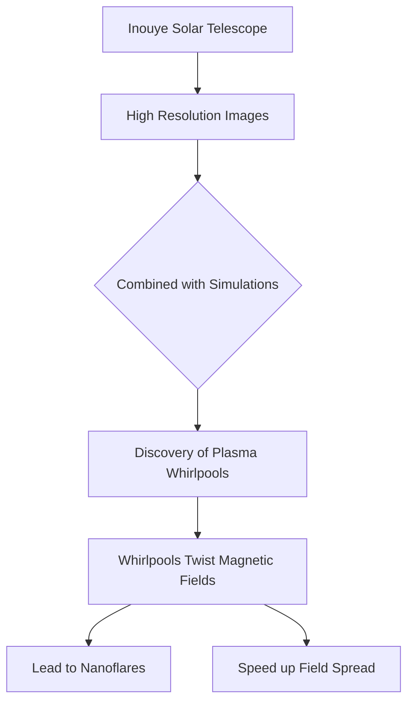

## Solar Scientists Uncover Tiny Plasma Whirlpools on the Sun's Surface

**August 8, 2026** – In a fascinating development for solar physics, scientists have today announced the discovery of incredibly tiny plasma whirlpools swirling across the surface of the Sun. Some of these vortices measure as little as 20 kilometers wide, offering unprecedented insight into the complex dynamics of our star.

The breakthrough was made possible through the combined efforts of observations from the powerful NSF Daniel K. Inouye Solar Telescope and advanced computer simulations. These cutting-edge tools provided images detailed enough to expose plasma motions that were previously invisible, pushing the limits of what solar telescopes and simulations can achieve.

These newly identified plasma whirlpools are believed to play a significant role in twisting the Sun's magnetic fields. This twisting could contribute to the energy buildup that is eventually released in small solar eruptions known as nanoflares. Furthermore, the vortices may help magnetic fields spread through the Sun's atmosphere much faster than current models can explain, potentially reshaping our understanding of solar magnetic activity and its impact on space weather.

Understanding these tiny structures is crucial for unraveling how the Sun stores, moves, and releases its immense magnetic energy, which in turn influences phenomena that can affect Earth.

