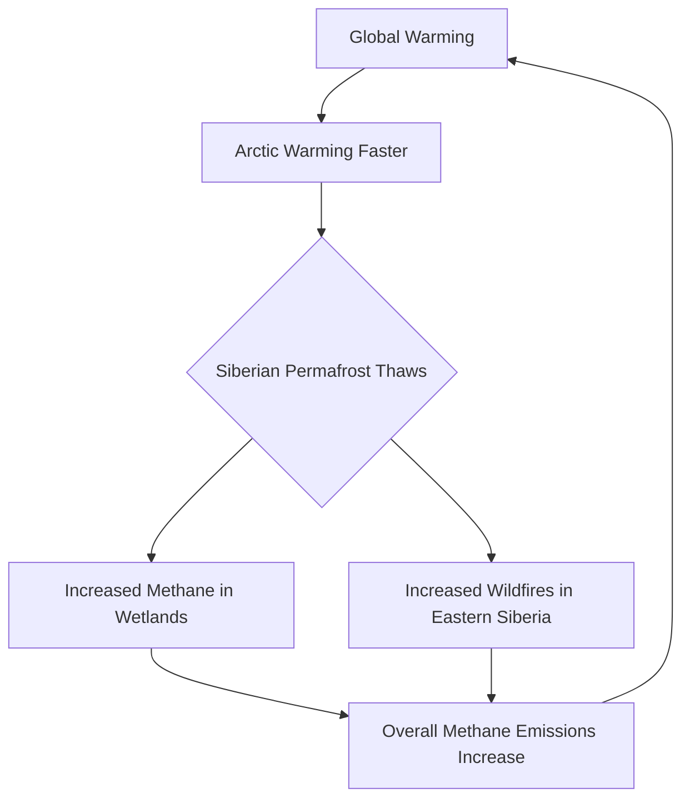

## Science Snapshot: August 9, 2026 – Unearthing Ancient Secrets and Tackling Modern Challenges

As we navigate August 2026, the world of science continues to push boundaries, revealing insights into our planet's past, present, and future. From startling discoveries beneath the Earth to groundbreaking advancements in medicine and ongoing climate concerns, here's a concise look at some of the latest developments.

One pressing environmental concern comes from a new study revealing that methane emissions from Siberia have more than doubled over the past decade. Research co-led by UK scientists indicates that rapid warming, an increase in wildfires, and changing wetland activity are driving this significant rise in the potent greenhouse gas. This accelerating process highlights a worrying feedback loop, where warming in the Arctic leads to more methane release, potentially causing further warming.

Meanwhile, archaeologists and materials scientists are piecing together fascinating details from antiquity. Chemical analysis of Bronze Age iron objects suggests that ancient Greek nobles might have possessed signet rings crafted from precious metal sourced from meteorites. This cosmic connection adds an intriguing layer to our understanding of early metallurgical practices and the cultural significance of rare materials.

On the medical front, promising advancements are on the horizon for cancer detection. Clinical trials underway in the United Kingdom are testing a single blood test designed to identify approximately 50 types of cancer before symptoms even appear. The test works by detecting fragments of DNA released into the bloodstream by cancerous cells and can pinpoint the tissue or organ of origin. If these trials prove successful, this tool could revolutionize early cancer diagnosis and significantly improve treatment outcomes.

---

### Siberian Methane Emission Feedback Loop

---

These insights, ranging from climate dynamics to ancient artifacts and future medicine, underscore the relentless pace of scientific inquiry. Each discovery not only expands our knowledge but also inspires new avenues for research, shaping our understanding of the universe and our place within it.