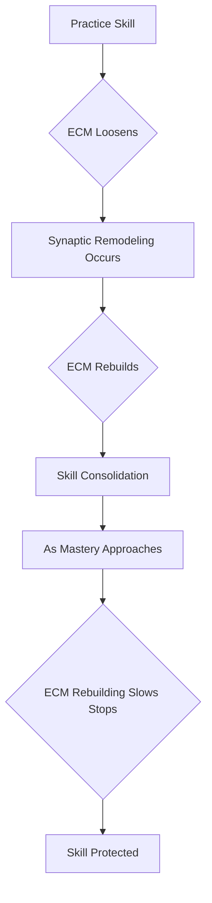

## New Discovery Unlocks the Brain's Secret to Learning and Skill Mastery

**August 10, 2026** – Groundbreaking research has revealed a dynamic physical mechanism in the adult brain that actively regulates learning and ensures the preservation of mastered skills. Published recently in the Proceedings of the National Academy of Sciences on August 3, 2026, this discovery by researchers at the University of Maryland offers new insights into brain plasticity and could have significant implications for fields like auditory rehabilitation.

For years, the extracellular matrix (ECM)—a scaffold-like structure surrounding brain cells—was considered a rigid, passive component. However, the new findings demonstrate that the ECM undergoes rapid, cyclical remodeling during skill acquisition. When a new skill is practiced, the ECM loosens within hours, allowing for synaptic remodeling. Approximately 24 hours later, the ECM rebuilds, consolidating the learned gains.

As a skill approaches mastery, this ECM rebuilding cycle slows and eventually ceases. This mechanism effectively "seals" neural circuits, protecting learned skills from decay or being overwritten by new information. This active regulation challenges previous models of adult brain plasticity, suggesting that the brain isn't merely storing what's learned, but also controlling *when* and *how* learning occurs.

The implications of this research are vast. For instance, understanding these learning windows could improve therapeutic interventions, such as timing auditory training for newly fitted cochlear implant patients. Identifying the molecules that trigger these ECM changes and exploring their role in hearing loss are next steps for the research team.

Here's a simplified look at the process:

