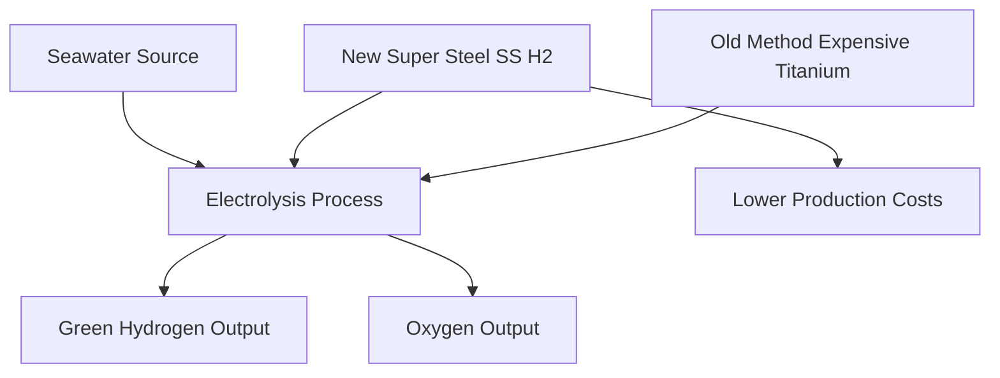

## Breakthrough Steel Makes Green Hydrogen Cheaper, More Accessible

**August 11, 2026** – A significant advancement in material science promises to revolutionize the production of green hydrogen. Scientists at the University of Hong Kong (HKU) have engineered a novel stainless steel, dubbed SS-H2, designed to withstand the highly corrosive conditions inherent in seawater-based green hydrogen production. This breakthrough could drastically cut costs and accelerate the adoption of this vital clean energy source.

Green hydrogen, produced by splitting water into hydrogen and oxygen using renewable electricity, is a cornerstone of future sustainable energy systems. However, the electrolysis equipment required for this process faces demanding chemical and electrical environments, particularly when utilizing abundant seawater. Conventional stainless steels often succumb to corrosion, necessitating the use of expensive alternatives like titanium.

The newly developed SS-H2, part of Professor Mingxin Huang's "Super Steel" Project at HKU, has demonstrated remarkable corrosion resistance under these extreme conditions. This property allows it to potentially replace costly titanium components, reducing structural material costs by approximately 40 times. This substantial cost reduction could make seawater-based hydrogen production far more economical and scalable, paving the way for a more accessible and sustainable energy future.

