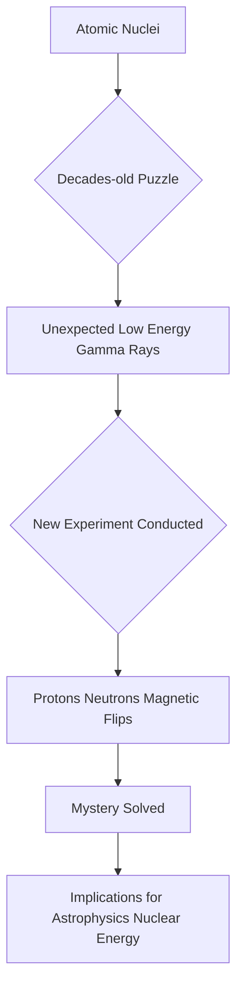

## Unveiling the Atomic Secret: Hidden Magnetism Explains Gamma Ray Mystery

**August 21, 2026** – Today marks a significant stride in nuclear physics as scientists have finally unraveled a decades-old enigma concerning the unexpected emission of low-energy gamma rays from certain atomic nuclei. A groundbreaking experiment has traced this phenomenon to subtle magnetic changes within the nucleus itself, where protons and neutrons effectively flip their tiny internal magnets.

For decades, researchers have observed that some atomic nuclei mysteriously produce a greater number of low-energy gamma rays than predicted by theoretical models. This "low-energy enhancement" was a puzzling inconsistency, lacking a clear explanation or a reliable way to predict its occurrence across different nuclei.

Now, a new study, primarily led by the Facility for Rare Isotope Beams (FRIB) with contributions from Lawrence Livermore National Laboratory (LLNL), has provided the answer. The findings, published in *Nature*, reveal that these unexpected gamma rays are a consequence of the magnetic moments of protons and neutrons within the nucleus undergoing a collective "flip." This internal magnetic reorientation releases energy in the form of these low-energy gamma rays.

This discovery is not merely an answer to a long-standing puzzle; it offers profound implications for various scientific fields. It will sharpen our models of nuclear reactions on Earth, enhancing our understanding of nuclear energy processes and national security applications. Furthermore, it could fundamentally reshape our understanding of how heavy elements are forged in the scorching hearts of stars and during dramatic cosmic events like neutron star mergers. This newfound insight into the microscopic magnetic world of atomic nuclei promises to unlock deeper secrets of the universe, from the smallest particles to the grandest stellar explosions.

