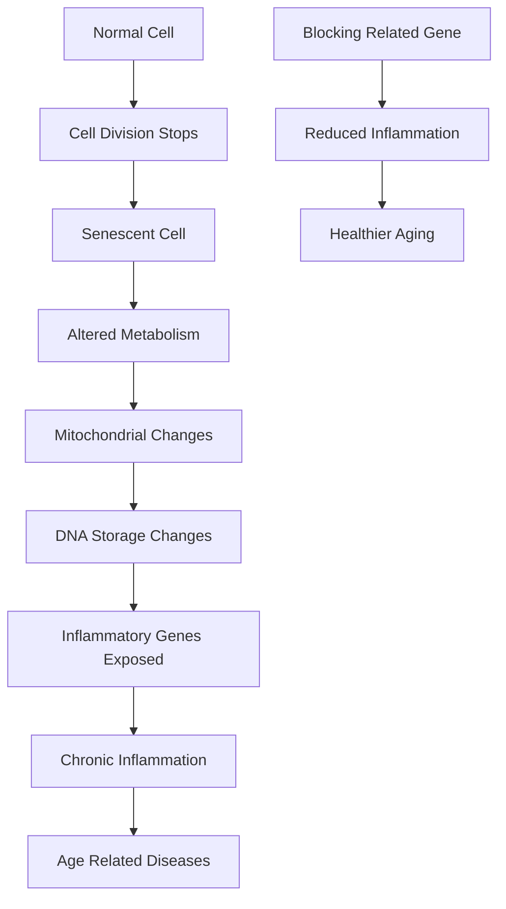

## Unlocking Healthier Aging: New Insights into "Zombie Cells" and Inflammation

Today, August 22, 2026, the scientific community is buzzing with recent findings that shed new light on the mechanisms behind aging and age-related diseases. Researchers have uncovered a crucial connection between "senescent cells"—often dubbed "zombie cells"—and chronic inflammation, a key driver of many ailments as we age.

A study published on July 29, 2026, in *Nature* by scientists from Sanford Burnham Prebys Medical Discovery Institute, Mayo Clinic, and their international collaborators, reveals that these senescent cells exhibit an altered metabolism involving their energy-producing mitochondria. This metabolic shift leads to changes in how DNA is stored, ultimately exposing inflammatory genes and promoting sustained inflammation within the body.

Normally, our immune system uses inflammation as a rapid response to injury or pathogens, a process vital for healing. However, as we get older, an accumulation of these senescent cells causes persistent, chronic inflammation. This long-term inflammation is strongly linked to numerous age-related diseases.

The exciting news is that the research also demonstrated that blocking a related gene in mice successfully reduced this inflammation and promoted healthier aging. This discovery offers a promising new avenue for therapeutic interventions, suggesting that targeting the specific metabolic pathways within senescent cells could be a game-changer in the quest for healthier, longer lives. Understanding and manipulating these "zombie cells" may be key to mitigating the destructive inflammation that contributes to age-related decline.

