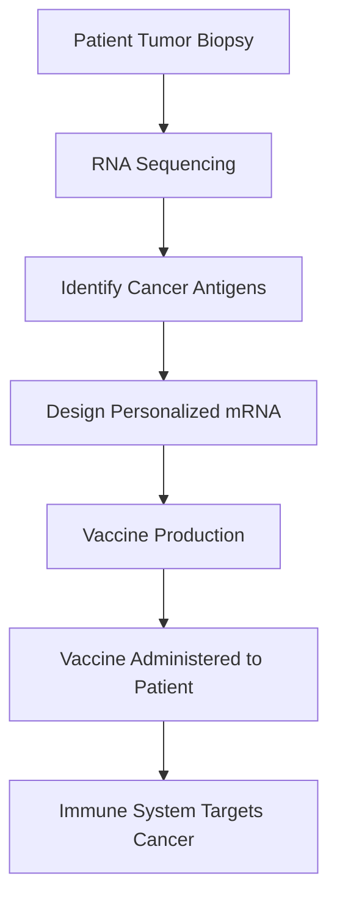

## A New Era in Cancer Treatment: Personalized mRNA Vaccines Show Promise Against Melanoma

In a significant leap forward for oncology, a personalized mRNA vaccine has demonstrated remarkable success in preventing the recurrence of melanoma in a late-stage clinical trial. This breakthrough, reported on August 20, 2026, offers renewed hope for patients battling one of the deadliest forms of skin cancer.

The experimental vaccine, co-developed by Moderna and Merck & Co., is designed to work in conjunction with the immunotherapy drug Keytruda. It functions by teaching the patient's immune system to recognize and attack cancer cells, specifically those unique to their own tumor. This individualized approach is a critical element, as each vaccine is built from the genetic information extracted directly from a patient's tumor.

The trial's findings mark the first Phase 3 study to show a vaccine can protect against recurrences of a highly aggressive cancer type. Experts are hailing this as a "breakthrough in the development of new cancer immunotherapies," with broad implications for other cancer types beyond melanoma.

The process behind these innovative personalized mRNA vaccines involves several key steps:

This personalized strategy leverages the body's own defense mechanisms, offering a highly targeted and potentially more effective treatment compared to conventional therapies. As research continues, the success of this melanoma vaccine could pave the way for a new generation of bespoke cancer treatments tailored to each individual.