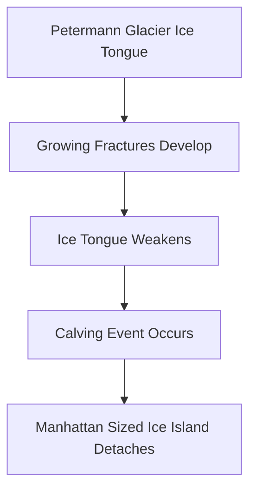

### Greenland's Petermann Glacier Loses Manhattan-Sized Ice Island

**August 26, 2026** – A significant event has unfolded in the Arctic today, as a colossal ice island, comparable in size to Manhattan, has broken away from Greenland's Petermann Glacier. This calving event is the largest loss of floating ice from Petermann Glacier since 2012 and the biggest Arctic calving event observed since 2020.

Years of growing fractures had weakened the glacier's floating ice tongue, leading to the detachment of the 76.4 square kilometer ice island on August 4, 2026, according to an international team of researchers led in part by the University of Ottawa. Scientists estimate the newly separated tabular iceberg could be as much as 150 meters thick, providing a rare opportunity for observation as it moves through the ocean.

The implications of this event extend beyond the immediate spectacle, as scientists anticipate that two more substantial sections could soon detach, potentially removing about 22 percent of the remaining ice tongue. Continuous satellite monitoring has tracked changes at Petermann Glacier since 2019, highlighting the ongoing instability of these critical polar ice masses.

Understanding and monitoring such calving events is crucial for glaciology and climate science, offering insights into the dynamics of ice sheets and their response to changing environmental conditions.

