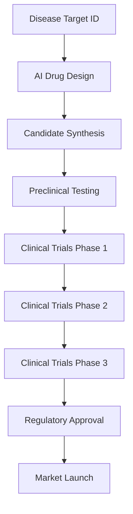

**AI Takes Center Stage in 2026: Revolutionizing Drug Discovery**

As of August 27, 2026, the scientific landscape is buzzing with transformative advancements, particularly in how we approach medicine. Artificial intelligence (AI) is no longer a peripheral tool but is now firmly at the core of drug discovery, promising to accelerate the delivery of life-saving treatments.

This year marks a pivotal moment where AI is reshaping every stage of drug development, from target identification to clinical trials. Previously, AI played a supporting role, but in 2026, it's expected to influence how targets are identified, biological data analyzed, and even development decisions made. This profound shift sees computational prediction increasingly used alongside experimental validation, leading to earlier hypothesis testing and reduced late-stage failures.

A prime example of this paradigm shift is Insilico Medicine, whose AI-designed drug for idiopathic pulmonary fibrosis has successfully completed Phase IIa trials, demonstrating dose-dependent improvement in lung function. This groundbreaking achievement saw the drug reach this milestone in approximately 18 months at a cost of around $6 million, a stark contrast to the traditional path which often takes 6-8 years and $100-200 million. While no end-to-end AI-discovered drug has yet received FDA approval, the progress of candidates like Insilico's in advanced phases signals a significant market event on the horizon. Regulatory bodies are also adapting, with the U.S. FDA and European Medicines Agency publishing ten principles for good AI practice in drug development in January 2026, emphasizing robust evidence and human oversight. Beyond drug discovery, CRISPR gene therapy continues its rapid ascent, with two FDA-approved treatments as of mid-2026 and numerous active clinical trials targeting a range of genetic diseases.

The integration of AI into drug discovery is not just an incremental improvement; it's a fundamental reimagining of the process. With faster timelines and reduced costs, the scientific community is on the cusp of a new era, bringing hope for quicker solutions to pressing health challenges.