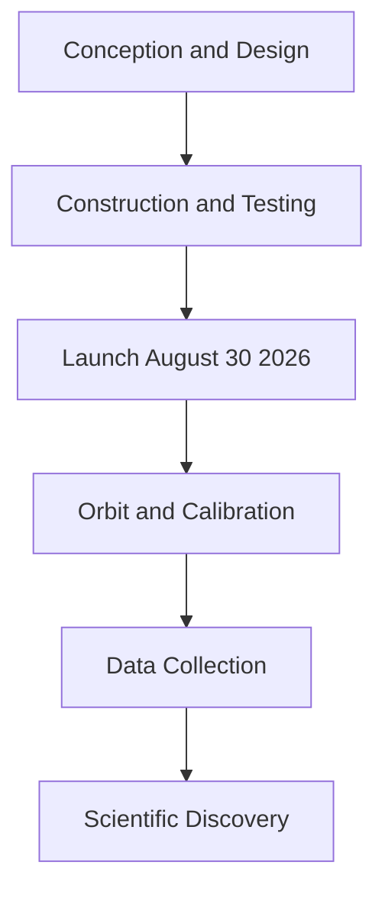

## Gearing Up for Galactic Wonders: NASA's Roman Space Telescope Poised for Launch

As August 2026 draws to a close, the scientific community holds its breath for a monumental event: the anticipated launch of NASA's Nancy Grace Roman Space Telescope on August 30th. Poised to revolutionize our understanding of the cosmos, Roman promises to deliver unprecedented views of the universe, combining the sharp detail of the Hubble Space Telescope with a field of view 100 times larger.

Scientists and engineers have dedicated two decades to designing and building this observatory, which is roughly the size of a tour bus and weighs as much as a Tyrannosaurus rex. This next-generation telescope is expected to begin delivering a flood of cutting-edge astronomical data early next year. Its mission is ambitious: to uncover hidden planets, meticulously map billions of cosmic objects, and delve into the mysteries of dark energy and dark matter. The Roman Space Telescope is named after NASA's first chief of astronomy, a pivotal advocate for the Hubble Space Telescope. Its wide-field infrared vision will enable astronomers to survey vast swathes of the sky quickly, potentially uncovering thousands of new exoplanets and providing new insights into the universe's expansion and evolution.

The impending launch marks a thrilling new chapter in space exploration, promising a wealth of discoveries that could reshape our cosmic perspective.

