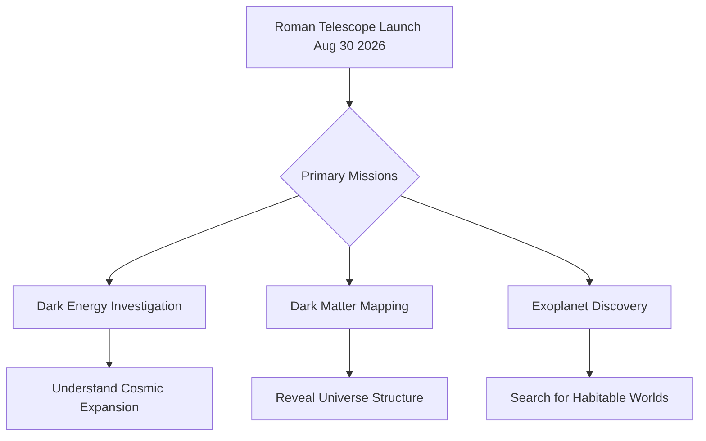

## Science Explores the Cosmos and Our Place Within It: Late August 2026 Updates

As August 2026 draws to a close, the scientific community is buzzing with significant developments, from the imminent launch of a groundbreaking space telescope to reaffirmations of the universe's mysterious expansion.

A major highlight on the horizon is the scheduled launch of NASA's **Nancy Grace Roman Space Telescope**, targeted for liftoff on August 30 from the Kennedy Space Center. This next-generation observatory is poised to revolutionize our understanding of the cosmos. Its primary missions include investigating the nature of dark energy, mapping the distribution of dark matter, and discovering thousands of new exoplanets, including potentially free-floating "rogue" planets. The Roman Telescope's wide-field view will complement other observatories, providing unprecedented insights into the universe's structure and evolution.

Adding to our cosmic understanding, new research published on August 29, 2026, has reaffirmed that the **universe's expansion is still accelerating**. This analysis challenges recent claims of a slowdown and reinforces the leading role of dark energy, the enigmatic force believed to be driving this acceleration. The findings, published in the *Monthly Notices of the Royal Astronomical Society*, preserve the standard cosmological model while leaving scientists with the enduring mystery of what dark energy truly is.

These ongoing endeavors underscore humanity's relentless pursuit of knowledge, pushing the boundaries of what we know about the universe and our existence within it.

