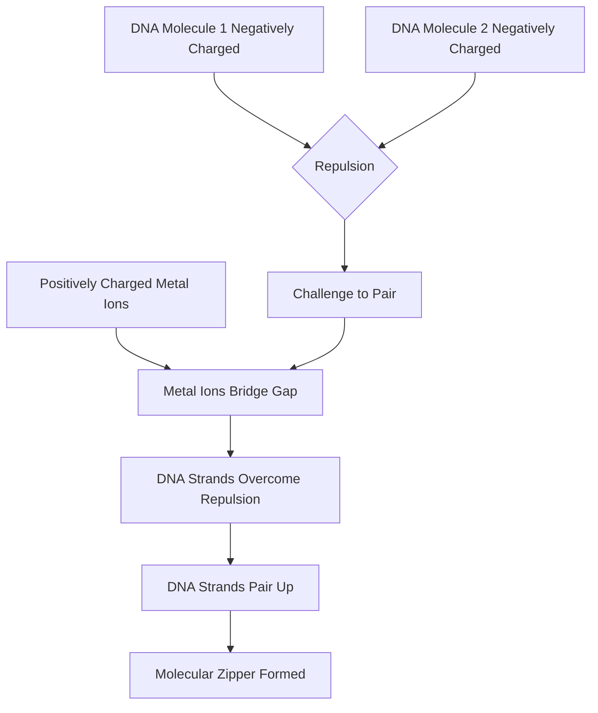

## Unzipping Life's Blueprint: Scientists Witness DNA Pairing in Real-Time

**September 10, 2026** – In a discovery that redefines our understanding of fundamental biological processes, scientists have for the first time directly observed how two negatively charged DNA molecules can come together and pair up, solving a mystery that has puzzled researchers for decades. This groundbreaking observation, made by teams at the University of York and the University of Sheffield, sheds new light on critical cellular functions and could have profound implications for understanding diseases like cancer.

DNA, the very blueprint of life, carries a negative electrical charge. According to basic physics, similarly charged objects should repel each other. Yet, within living cells, DNA molecules frequently come into close contact and recognize matching sequences, a process vital for genetic recombination, gene silencing, and even the repair of damaged DNA.

The key to this molecular embrace, researchers found, lies in positively charged metal ions. Using powerful atomic force microscopy, scientists watched as short pieces of DNA precisely aligned, groove for groove. Advanced computer simulations then revealed that these positively charged metal ions settle into the grooves of the DNA, acting as tiny molecular bridges that overcome the inherent repulsion and allow the strands to "zip" together. This experimental evidence confirms a twenty-year-old theoretical model known as the "DNA zipper" model.

"This discovery could help researchers identify regions of the genome specially involved in DNA pairing," stated Professor Agnes Noy from the School of Physics, Engineering and Technology at the University of York, who co-led the research. Understanding these regions could be crucial when mutations disrupt normal cellular processes and contribute to diseases such as cancer.

This monumental step forward in molecular biology not only fills a significant gap in our knowledge of DNA mechanics but also opens new avenues for therapeutic development and genetic research.

