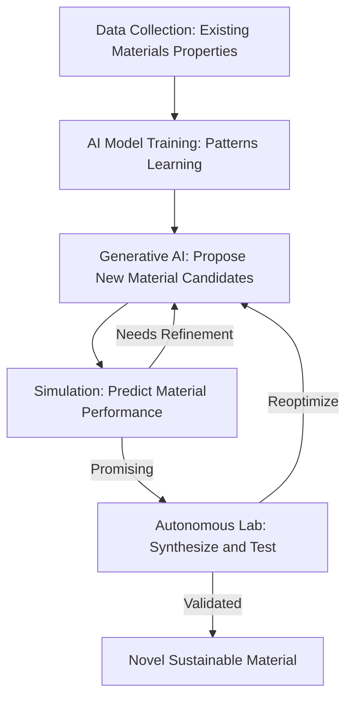

## AI Accelerates a New Era of Scientific Discovery in 2026

**September 13, 2026** – The pace of scientific innovation is accelerating at an unprecedented rate, largely propelled by advancements in artificial intelligence. This year, AI is not just assisting researchers; it's fundamentally transforming the discovery process across critical fields like sustainable energy and medicine, slashing development timelines from decades to mere months.

One of the most impactful areas witnessing this revolution is materials science, particularly for sustainable energy solutions. Scientists are leveraging advanced AI models, including generative models and graph neural networks, to discover and design novel materials with desired properties. This includes breakthroughs in solid-state battery electrolytes and highly efficient catalysts essential for green hydrogen production. A significant development in August 2026 saw researchers demonstrate a powerful AI modeling approach that accurately and rapidly predicts how reactions between solid materials unfold, dramatically accelerating the synthesis of new materials. These AI-driven methods are compressing materials discovery timelines, a shift celebrated at the 2026 GRC AI for Materials, Energy, and Chemical Sciences conference, themed "Autonomous Discovery Across Scales".

The integration of AI into laboratories, often termed "autonomous self-driving laboratories," is closing the loop between computational design and experimental realization, allowing for rapid iteration and testing of AI-generated material candidates.

Similarly, AI's role in drug discovery has become central to workflows in 2026, moving beyond isolated applications to core processes. AI is now routinely used for target identification, analyzing vast genomic and proteomic datasets, and generating novel molecular structures. A notable milestone occurred in July 2026 when an AI-discovered drug, rentosertib, began its Phase III clinical trial, marking a significant step towards AI-generated medicines reaching patients. Furthermore, researchers at the University of Missouri published a comprehensive review in September 2026 on "flow matching," an emerging AI approach poised to accelerate biomedical discoveries, including drug development and precision medicine.

The convergence of AI with scientific research is not merely an incremental improvement; it represents a paradigm shift towards data-driven, automated workflows that promise a future of faster, more efficient, and impactful discoveries.

