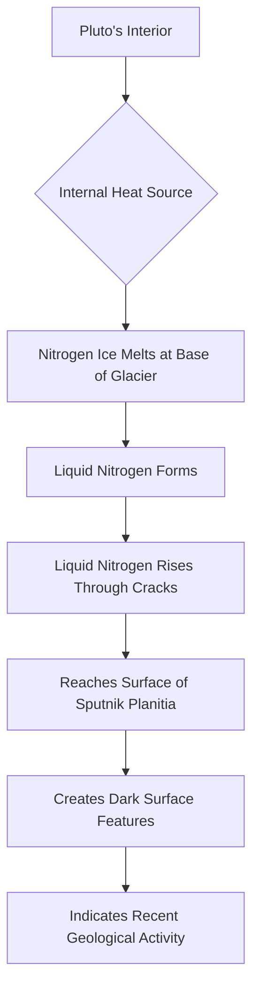

## Pluto, a Frozen World No More? Evidence of Active Liquid Flow Discovered!

**September 17, 2026** – Just when we thought we knew the icy dwarf planet Pluto, new research published today suggests a surprising level of geological activity, potentially involving liquid nitrogen flowing across its surface. This groundbreaking discovery challenges our previous understanding of Pluto as a largely dormant world.

Scientists have uncovered the first evidence indicating that liquid may have recently flowed across Pluto's surface. Dark features observed on the enormous Sputnik Planitia glacier are consistent with liquid nitrogen rising through cracks from deep beneath the ice. Computer models further support this theory, showing that nitrogen could melt at the glacier's base and travel upward through small conduits.

This revelation suggests Pluto may be far more geologically active than its frozen appearance implies. The new analysis, led by the Southwest Research Institute (SwRI) and based on observations from NASA's New Horizons spacecraft, specifically points to liquid nitrogen moving upward near the northern edge of Sputnik Planitia.

"Pluto never stops surprising us," stated Dr. Alan Stern, SwRI Associate Vice President and principal investigator of the New Horizons mission. "In addition to suggesting that liquids have recently expressed themselves on Pluto's surface, it also suggests a new kind of time-variable feature on Pluto." This finding marks a significant step in understanding the complex processes occurring on distant celestial bodies.

The implications are profound, hinting at internal heat sources and dynamic geological processes previously unexpected for such a distant and cold world. Our solar system continues to unveil its secrets, reminding us that exploration always yields new wonders.

