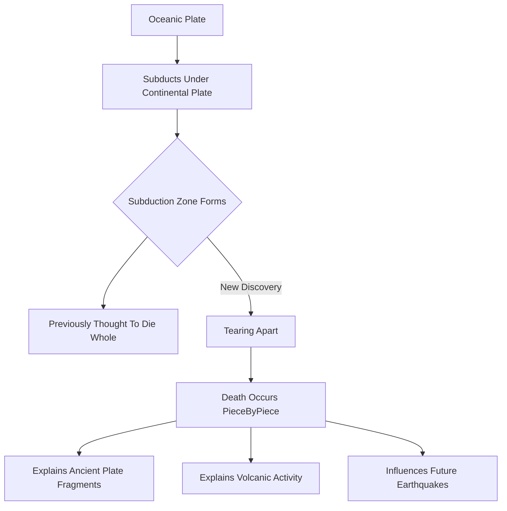

## Earth's Tectonic Plates Revealed to Die "Piece by Piece"

In a significant geological discovery, scientists have captured an unprecedented view of a subduction zone off Vancouver Island in the process of tearing itself apart. This groundbreaking observation, reported on September 25, 2026, challenges previous understandings of how these massive tectonic systems conclude their life cycle.

Subduction zones occur where one tectonic plate is forced beneath another, plunging deep into the Earth's mantle. These zones are responsible for some of the planet's most powerful earthquakes, volcanic eruptions, and long-term changes to continents and ocean basins. For years, it was largely theorized that these enormous systems ceased activity all at once.

However, researchers from Louisiana State University, utilizing detailed earthquake records and seismic reflection imaging, have found that these zones may actually die "piece by piece" rather than as a single, cohesive unit. This detailed insight into a major tectonic system actively breaking into fragments provides crucial clues for geologists. The discovery could shed new light on ancient plate fragments, help explain certain volcanic activity, and influence how we predict future earthquakes, particularly in regions like Cascadia. Understanding the demise of subduction zones is fundamental to comprehending the continuous reshaping of Earth's surface over millions of years.

