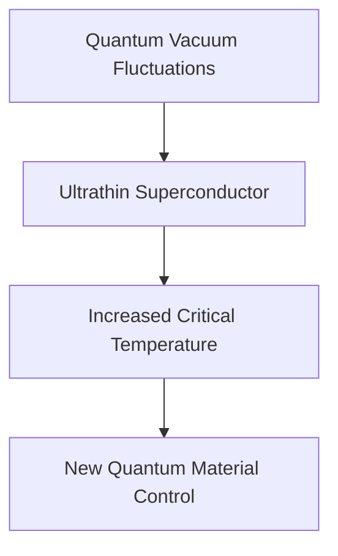

**Quantum "Empty Space" Boosts Superconductivity**

Science continues to unveil the universe's most subtle yet powerful forces. In a groundbreaking discovery published on October 3, 2026, researchers have demonstrated that what we perceive as "empty space" can actually enhance superconductivity. This finding opens a novel pathway for controlling quantum materials.

Superconductors are materials that conduct electricity with zero resistance below a certain critical temperature. For years, scientists have sought ways to raise this transition temperature, making these remarkable materials more practical for everyday applications. Now, a team has shown that quantum fluctuations within a vacuum can significantly strengthen superconductivity in an ultrathin material.

In quantum physics, a vacuum is not truly empty; it's a bustling sea of virtual particles constantly appearing and disappearing, leading to what are known as quantum fluctuations. The researchers, led by Profs. Changgan Zeng and Guanghui Cheng of the University of Science and Technology of China, observed that placing an ultrathin material (specifically, six-layer NbSe2) within a specially designed cavity, which allowed for controlled vacuum fluctuations, increased its superconducting critical temperature by up to 5.4%.

This pioneering work suggests a previously unrecognized method to manipulate quantum materials without direct contact or external driving. It offers exciting prospects for developing new, more robust superconductors and advancing our understanding of quantum phenomena at their most fundamental level.

